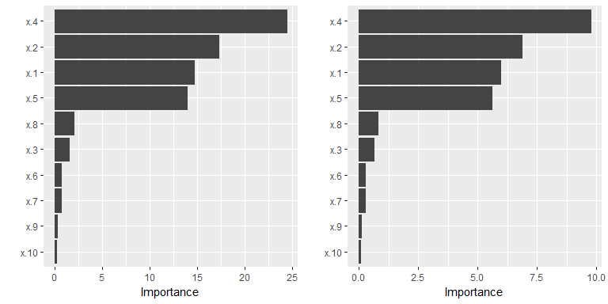
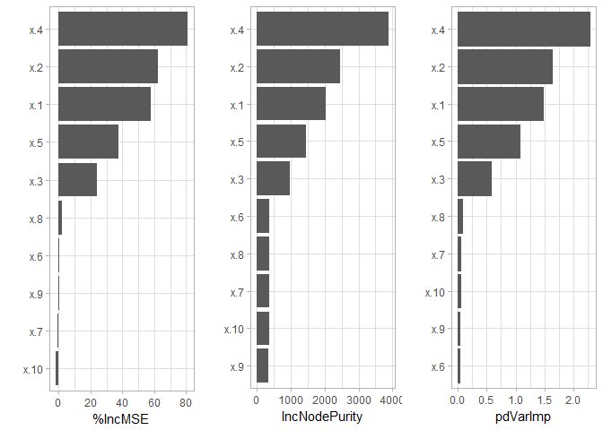
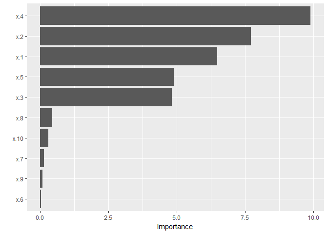
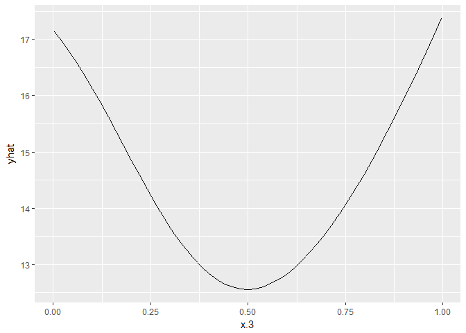

<!-- README.md is generated from README.Rmd. Please edit that file -->
vip: Variable Importance Plots 
======================================================================================================

Variable importance plots.

Installation
------------

The `vip` package is currently only available from GitHub, but can easily be installed using the [devtools](https://CRAN.R-project.org/package=devtools) package:

``` r
if (!requireNamespace("devtools")) install.packages("devtools")
devtools::install_github("AFIT-R/vip")
```

Example usage
-------------

For illustration, we use one of the regression problems described in Friedman (1991) and Breiman (1996). Inputs are 10 independent variables uniformly distributed on the interval \[0,1\]; only 5 out of these 10 are actually used. Outputs are created according to the formula
𝒴 = 10sin(*π**x*<sub>1</sub>*x*<sub>2</sub>) + 20(*x*<sub>3</sub>−0.5)<sup>2</sup> + 10*x*<sub>4</sub> + 5*x*<sub>5</sub> + *ϵ*,
 where *ϵ* ∼ 𝒩(0,*σ*). These data are available in the [mlbench](https://CRAN.R-project.org/package=mlbench) package. The code chunk below simulate 500 observations from the above model with $\\simga = 1$.

``` r
if (!requireNamespace("mlbench")) install.packages("mlbench")
#> Loading required namespace: mlbench
set.seed(101)  # for reproducibility
trn <- as.data.frame(mlbench::mlbench.friedman1(n = 500, sd = 1))
tibble::glimpse(trn)
#> Observations: 500
#> Variables: 11
#> $ x.1  <dbl> 0.37219838, 0.04382482, 0.70968402, 0.65769040, 0.2498557...
#> $ x.2  <dbl> 0.405543776, 0.602277006, 0.361999719, 0.291215631, 0.793...
#> $ x.3  <dbl> 0.1016229, 0.6022517, 0.2536424, 0.5419870, 0.3834077, 0....
#> $ x.4  <dbl> 0.32248033, 0.99866400, 0.54841191, 0.32741994, 0.9474793...
#> $ x.5  <dbl> 0.69258669, 0.77643413, 0.01797597, 0.22965950, 0.4623621...
#> $ x.6  <dbl> 0.757968756, 0.532993932, 0.764821812, 0.300911111, 0.004...
#> $ x.7  <dbl> 0.5178155773, 0.5094877817, 0.7150814026, 0.1767543119, 0...
#> $ x.8  <dbl> 0.53039420, 0.48748739, 0.84445523, 0.34578953, 0.1141428...
#> $ x.9  <dbl> 0.87786519, 0.11769849, 0.33436272, 0.47444784, 0.4886461...
#> $ x.10 <dbl> 0.76275126, 0.17556921, 0.11837389, 0.28301930, 0.3106974...
#> $ y    <dbl> 14.871525, 15.265025, 15.058655, 10.734693, 17.599652, 18...
```

### Linear model

``` r
library(vip)
trn.lm <- lm(y ~ ., data = trn)
p1 <- vip(trn.lm)
p2 <- vip(trn.lm, use.partial = TRUE)
grid.arrange(p1, p2, ncol = 2)  # display plots side-by-side
```



### Random forest

``` r
library(randomForest)  # install.packages("randomForest")
#> randomForest 4.6-12
#> Type rfNews() to see new features/changes/bug fixes.
set.seed(102)
trn.rf <- randomForest(y ~ ., data = trn, importance = TRUE)
importance(trn.rf)  # for comparison
#>         %IncMSE IncNodePurity
#> x.1  58.0501500     2031.3429
#> x.2  62.4602945     2452.2436
#> x.3  23.7733170      981.4111
#> x.4  80.8570318     3881.1733
#> x.5  37.6504691     1450.5060
#> x.6   0.2492677      360.3313
#> x.7  -0.4120762      359.4616
#> x.8   2.0313513      359.6807
#> x.9   0.1074481      332.3254
#> x.10 -1.9331819      357.8049
vip(trn.rf, use.partial = TRUE, pred.var = paste0("x.", 1:10))
```



### Neural network

``` r
library(ggplot2)
#> 
#> Attaching package: 'ggplot2'
#> The following object is masked from 'package:randomForest':
#> 
#>     margin
library(nnet)  # install.packages("nnet")
set.seed(103)
trn.nn <- nnet(y ~ ., data = trn, size = 10, linout = TRUE, decay = 0.001,
               maxit = 1000, trace = FALSE)
vip(trn.nn, use.partial = TRUE, pred.var = paste0("x.", 1:10), alpha = 0.5) +
  theme_light() +
  ylab("Partial dependence-based variable importance") +
  ggtitle("Neural network variable importance scores")
```



You can also request the partial dependence data be returned in an attribute called `"partial"`. For example, we can see that the fitted neural network did indeed pick up the linear relationship between *x*<sub>3</sub> and 𝒴:

``` r
pdVarImp(trn.nn, pred.var = "x.3")
#> [1] 4.813074
imp <- pdVarImp(trn.nn, pred.var = "x.3", return.partial = TRUE)
ggplot2::autoplot(attr(imp, "partial"))
```


