This vignette is essentially an up-to-date version of @RJ-2020-013. Please use that if you'd like to cite our work.

## Introduction

Too often machine learning (ML) models are summarized using a single metric (e.g., cross-validated accuracy) and then put into production. Although we often care about the predictions from these models, it is becoming routine (and good practice) to also better understand the predictions! Understanding how an ML model makes its predictions helps build trust in the model and is the fundamental idea of the emerging field of *interpretable machine learning* (IML).^[Although "interpretability" is difficult to formally define in the context of ML, we follow @doshivelez-2017-rigorous and describe "interpretable" as the "...ability to explain or to present in understandable terms to a human."] For an in-depth discussion on IML, see @molnar-2019-iml. In this paper, we focus on *global methods* for quantifying the importance^[In this context "importance" can be defined in a number of different ways. In general, we can describe it as *the extent to which a feature has a "meaningful" impact on the predicted outcome*. A more formal definition and treatment can be found in @laan-2006-statistical.] of features in an ML model; that is, methods that help us understand the global contribution each feature has to a model's predictions. Computing variable importance (VI) and communicating them through variable importance plots (VIPs) is a fundamental component of IML and is the main topic of this paper.

While many of the procedures discussed in this paper apply to any model that makes predictions, it should be noted that these methods heavily depend on the accuracy and importance of the fitted model; hence, unimportant features may appear relatively important (albeit not predictive) in comparison to the other included features. For this reason, we stress the usefulness of understanding the scale on which VI scores are calculated and take that into account when assessing the importance of each feature and communicating the results to others. Also, we should point out that this work focuses mostly on *post-hoc interpretability* where a trained model is given and the goal is to understand what features are driving the model's predictions. Consequently, our work focuses on functional understanding of the model in contrast to the lower-level mechanistic understanding [@montavon-2018-methods]. That is, we seek to explain the relationship between the model's prediction behavior and features without explaining the full internal representation of the model.^[We refer the reader to @poulin-2006-visual, @caruana-2015-intelligible, @bibal-2016-intterpretability, and @bau-2017-network, for discussions around model structure interpretation.]

<!-- For this reason, we stress the usefulness of understanding the scale on which VI scores are calculated and take that into account when assessing the importance of each feature and communicating the results to others. -->

VI scores and VIPs can be constructed for general ML models using a number of available packages. The [iml](https://cran.r-project.org/package=iml) package [@R-iml] provides the `FeatureImp()` function which computes feature importance for general prediction models using the permutation approach (discussed later). It is written in [R6](https://cran.r-project.org/package=R6) [@R-R6] and allows the user to specify a generic loss function or select one from a pre-defined list (e.g., \code{loss = "mse"} for mean squared error). It also allows the user to specify whether importance is measured as the difference or as the ratio of the original model error and the model error after permutation. The user can also specify the number of repetitions used when permuting each feature to help stabilize the variability in the procedure. The \code{iml::FeatureImp()} function can also be run in parallel using any parallel backend supported by the [foreach](https://cran.r-project.org/package=foreach) package [@R-foreach].

The [ingredients](https://cran.r-project.org/package=ingredients) package [@R-ingredients] also provides permutation-based VI scores through the `feature_importance()` function. (Note that this function recently replaced the now deprecated [DALEX](https://cran.r-project.org/package=DALEX) function `variable_importance()` [@R-DALEX].) Similar to `iml::FeatureImp()`, this function allows the user to specify a loss function and how the importance scores are computed (e.g., using the difference or ratio). It also provides an option to sample the training data before shuffling the data to compute importance (the default is to use `n_sample = 1000`), which can help speed up computation.

The [mmpf](https://cran.r-project.org/package=mmpf) package [@R-mmpf] also provides permutation-based VI scores via the `mmpf::permutationImportance()` function. Similar to the [iml](https://cran.r-project.org/package=iml) and [ingredients](https://cran.r-project.org/package=ingredients) implementation, this function is flexible enough to be applied to any class of ML models in R.

The [varImp](https://cran.r-project.org/package=varImp) package [@R-varImp] extends the permutation-based method for RFs in package [party](https://cran.r-project.org/package=party) [@R-party] to arbitrary measures from the [measures](https://cran.r-project.org/package=measures) package [@R-measures]. Additionally, the functions in [varImp](https://cran.r-project.org/package=varImp) include the option of using the conditional approach described in @strobl-2019-conditional which is more reliable in the presence of correlated features. A number of other RF-specific VI packages exist on CRAN, including, but not limited to, [vita](https://cran.r-project.org/package=vita) [@R-vita], [rfVarImpOOB](https://cran.r-project.org/package=rfVarImpOOB) [@R-rfVarImpOOB], [randomForestExplainer](https://cran.r-project.org/package=randomForestExplainer) [@R-randomForestExplainer], and [tree.interpreter](https://cran.r-project.org/package=tree.interpreter) [@R-tree.interpreter].^[These packages were discovered using [pkgsearch](https://cran.r-project.org/package=pkgsearch)'s \code{ps()} function [@R-pkgsearch] with the key phrases "variable importance" and "feature importance".].

The [caret](https://cran.r-project.org/package=caret) package [@R-caret] includes a general `varImp()` function for computing model-specific and *filter-based* VI scores. Filter-based approaches, which are described in @applied-kuhn-2013, do not make use of the fitted model to measure VI. They also do not take into account the other predictors in the model. For regression problems, a popular filter-based approach to measuring the VI of a numeric predictor $x$ is to first fit a flexible nonparametric model between $x$ and the target $Y$; for example, the locally-weighted polynomial regression (LOWESS) method developed by @robust-cleveland-1979. From this fit, a pseudo-$R^2$ measure can be obtained from the resulting residuals and used as a measure of VI. For categorical predictors, a different method based on standard statistical tests (e.g., $t$-tests and ANOVAs) can be employed; see @applied-kuhn-2013 for details. For classification problems, an area under the ROC curve (AUC) statistic can be used to quantify predictor importance. The AUC statistic is computed by using the predictor $x$ as input to the ROC curve. If $x$ can reasonably separate the classes of $Y$, that is a clear indicator that $x$ is an important predictor (in terms of class separation) and this is captured in the corresponding AUC statistic. For problems with more than two classes, extensions of the ROC curve or a one-vs-all approach can be used.

If you use the [mlr](https://cran.r-project.org/package=mlr) interface for fitting ML models [@R-mlr], then you can use the `getFeatureImportance()` function to extract model-specific VI scores from various tree-based models (e.g., RFs and GBMs). Unlike [caret](https://cran.r-project.org/package=caret), the model needs to be fit via the [mlr](https://cran.r-project.org/package=mlr) interface; for instance, you cannot use `getFeatureImportance()` on a [ranger](https://cran.r-project.org/package=ranger) [@R-ranger] model unless it was fit using [mlr](https://cran.r-project.org/package=mlr).

While the [iml](https://cran.r-project.org/package=iml) and [DALEX](https://cran.r-project.org/package=DALEX) packages provide model-agnostic approaches to computing VI, [caret](https://cran.r-project.org/package=caret), and to some extent, [mlr](https://cran.r-project.org/package=mlr), provide model-specific approaches (e.g., using the absolute value of the $t$-statistic for linear models) as well as less accurate filter-based approaches. Furthermore, each package has a completely different interface (e.g., [iml](https://cran.r-project.org/package=iml) is written in R6). The [vip](https://cran.r-project.org/package=vip) package [@R-vip] strives to provide a consistent interface to both model-specific and model-agnostic approaches to feature importance that is simple to use. The three most important functions exported by [vip](https://cran.r-project.org/package=vip) are described below:

  * `vi()` computes VI scores using model-specific or model-agnostic approaches (the results are always returned as a tibble [@R-tibble});

  * `vip()` constructs VIPs using model-specific or model-agnostic approaches with [ggplot2](https://cran.r-project.org/package=ggplot2)-style graphics [@R-ggplot2];

There's also a function called `vint()` (for variable interactions) but it is experimental and will not be discussed here; the interested reader is pointed to @greenwell-simple-2018. Note that `vi()` is actually a wrapper around four workhorse functions, `{vi_model()`, `vi_firm()`, `vi_permute()`, and `vi_shap()`, that compute various types of VI scores. The first computes model-specific VI scores, while the latter three produce model-agnostic ones. The workhorse function that actually gets called is controlled by the `method` argument in `vi()`; the default is `method = "model"` which corresponds to model-specific VI (see `?vip::vi` for details and links to further documentation).


## Constructing VIPs in R

We'll illustrate major concepts using the Friedman 1 benchmark problem described in @multivariate-friedman-1991 and @bagging-breiman-1996:

\begin{equation}
  Y_i = 10 \sin\left(\pi X_{1i} X_{2i}\right) + 20 \left(X_{3i} - 0.5\right) ^ 2 + 10 X_{4i} + 5 X_{5i} + \epsilon_i, \quad i = 1, 2, \dots, n,
(\#eq:friedman)
\end{equation}

where $\epsilon_i \stackrel{iid}{\sim} N\left(0, \sigma^2\right)$. Data from this model can be generated using the `vip::gen_friedman()`. By default, the features consist of 10 independent variables uniformly distributed on the interval $\left[0,1\right]$; however, only 5 out of these 10 are actually used in the true model. The code chunk below simulates 500 observations from the model in Equation \@ref(eq:friedman) with $\sigma = 1$; see `?vip::gen_friedman` for details.


```r
trn <- vip::gen_friedman(500, sigma = 1, seed = 101)  # simulate training data
tibble::as_tibble(trn)  # inspect output
```

```
## # A tibble: 500 × 11
##        y     x1    x2    x3    x4     x5      x6    x7    x8    x9   x10
##    <dbl>  <dbl> <dbl> <dbl> <dbl>  <dbl>   <dbl> <dbl> <dbl> <dbl> <dbl>
##  1 14.9  0.372  0.406 0.102 0.322 0.693  0.758   0.518 0.530 0.878 0.763
##  2 15.3  0.0438 0.602 0.602 0.999 0.776  0.533   0.509 0.487 0.118 0.176
##  3 15.1  0.710  0.362 0.254 0.548 0.0180 0.765   0.715 0.844 0.334 0.118
##  4 10.7  0.658  0.291 0.542 0.327 0.230  0.301   0.177 0.346 0.474 0.283
##  5 17.6  0.250  0.794 0.383 0.947 0.462  0.00487 0.270 0.114 0.489 0.311
##  6 18.3  0.300  0.701 0.992 0.386 0.666  0.198   0.924 0.775 0.736 0.974
##  7 14.6  0.585  0.365 0.283 0.488 0.845  0.466   0.715 0.202 0.905 0.640
##  8 17.0  0.333  0.552 0.858 0.509 0.697  0.388   0.260 0.355 0.517 0.165
##  9  8.54 0.622  0.118 0.490 0.390 0.468  0.360   0.572 0.891 0.682 0.717
## 10 15.0  0.546  0.150 0.476 0.706 0.829  0.373   0.192 0.873 0.456 0.694
## # ℹ 490 more rows
```

From Equation \@ref(eq:friedman), it should be clear that features $X_1$--$X_5$ are the most important! (The others don't influence $Y$ at all.) Also, based on the form of the model, we'd expect $X_4$ to be the most important feature, probably followed by $X_1$ and $X_2$ (both comparably important), with $X_5$ probably being less important. The influence of $X_3$ is harder to determine due to its quadratic nature, but it seems likely that this nonlinearity will suppress the variable's influence over its observed range (i.e., 0--1).


# Model-specific VI

Some machine learning algorithms have their own way of quantifying the importance of each feature, which we refer to as *model-specific VI*. We describe some of these in the subsections that follow. One particular issue with model-specific VI scores is that they are not necessarily comparable across different types of models. For example, directly comparing the impurity-based VI scores from tree-based models to the the absolute value of the $t$-statistic in linear models.


## Decision trees and tree ensembles

Decision trees probably offer the most natural model-specific approach to quantifying the importance of each feature. In a binary decision tree, at each node $t$, a single predictor is used to partition the data into two homogeneous groups. The chosen predictor is the one that maximizes some measure of improvement $i^t$. The relative importance of predictor $X$ is the sum of the squared improvements over all internal nodes of the tree for which $X$ was chosen as the partitioning variable; see @classification-breiman-1984 for details. This idea also extends to ensembles of decision trees, such as RFs and GBMs. In ensembles, the improvement score for each predictor is averaged across all the trees in the ensemble. Fortunately, due to the stabilizing effect of averaging, the improvement-based VI metric is often more reliable in large ensembles; see @hastie-elements-2009 [p. 368].

RFs offer an additional method for computing VI scores. The idea is to use the leftover *out-of-bag* (OOB) data to construct validation-set errors for each tree. Then, each predictor is randomly shuffled in the OOB data and the error is computed again. The idea is that if variable $X$ is important, then the validation error will go up when $X$ is perturbed in the OOB data. The difference in the two errors is recorded for the OOB data then averaged across all trees in the forest. Note that both methods for constructing VI scores can be unreliable in certain situations; for example, when the predictor variables vary in their scale of measurement or their number of categories [@party2007a, or when the predictors are highly correlated [@strobl-2019-conditional]. The [varImp](https://cran.r-project.org/package=varImp) package discussed earlier provides methods to address these concerns for random forests in package [party](https://cran.r-project.org/package=party), with similar functionality also built into the [partykit](https://cran.r-project.org/package=partykit) package [@R-partykit]. The [vip](https://cran.r-project.org/package=vip) package also supports the conditional importance described in [@strobl-2019-conditional] for both [party](https://cran.r-project.org/package=party)- and [partykit](https://cran.r-project.org/package=partykit)-based RFs; see `?vip::vi_model` for details. Later on, we'll discuss a more general permutation method that can be applied to any supervised learning model.

To illustrate, we fit a CART-like regression tree, RF, and GBM to the simulated training data. (**Note:** there are a number of different packages available for fitting these types of models, we just picked popular implementations for illustration.)


```r
# Load required packages
library(rpart)          # for fitting CART-like decision trees
library(randomForest)   # for fitting RFs
library(xgboost)        # for fitting GBMs

# Fit a single regression tree
tree <- rpart(y ~ ., data = trn)

# Fit an RF
set.seed(101)  # for reproducibility
rfo <- randomForest(y ~ ., data = trn, importance = TRUE)

# Fit a GBM
set.seed(102)  # for reproducibility
bst <- xgboost(
  data = data.matrix(subset(trn, select = -y)),
  label = trn$y,
  objective = "reg:squarederror",
  nrounds = 100,
  max_depth = 5,
  eta = 0.3,
  verbose = 0  # suppress printing
)
```

Each of the above packages include the ability to compute VI scores for all the features in the model; however, the implementation is rather package-specific, as shown in the code chunk below. The results are displayed in Figure \@ref(fig:vi-plots) (the code to reproduce these plots has been omitted but can be made available upon request).


```r
# Extract VI scores from each model
vi_tree <- tree$variable.importance
vi_rfo <- rfo$variable.importance  # or use `randomForest::importance(rfo)`
vi_bst <- xgb.importance(model = bst)
```

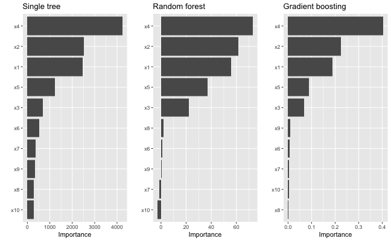

As we would expect, all three methods rank the variables `x1`--`x5` as more important than the others. While this is good news, it is unfortunate that we have to remember the different functions and ways of extracting and plotting VI scores from various model fitting functions. This is one place where [vip](https://cran.r-project.org/package=vip) can help...one function to rule them all! Once [vip](https://cran.r-project.org/package=vip) is loaded, we can use `vi()` to extract a tibble of VI scores.^[In order to avoid deprecation warnings due to recent updates to [tibble](https://cran.r-project.org/package=tibble) and [ggplot2](https://cran.r-project.org/package=ggplot2), the code examples in this article are based on the latest development versions of both [vip](https://cran.r-project.org/package=vip) (version 0.3.2.9000) and [pdp](https://cran.r-project.org/package=pdp) (version 0.8.1); the URL to the development version of each package is available on its associated CRAN landing page.]


```r
# Load required packages
library(vip)

# Compute model-specific VI scores
vi(tree)  # CART-like decision tree
```

```
## # A tibble: 10 × 2
##    Variable Importance
##    <chr>         <dbl>
##  1 x4            4234.
##  2 x2            2513.
##  3 x1            2461.
##  4 x5            1230.
##  5 x3             688.
##  6 x6             533.
##  7 x7             357.
##  8 x9             331.
##  9 x8             276.
## 10 x10            275.
```

```r
vi(rfo)   # RF
```

```
## # A tibble: 10 × 2
##    Variable Importance
##    <chr>         <dbl>
##  1 x4           72.9  
##  2 x2           61.4  
##  3 x1           55.6  
##  4 x5           37.0  
##  5 x3           22.0  
##  6 x8            1.84 
##  7 x6            1.12 
##  8 x9            0.720
##  9 x7           -1.39 
## 10 x10          -2.61
```

```r
vi(bst)   # GBM
```

```
## # A tibble: 10 × 2
##    Variable Importance
##    <chr>         <dbl>
##  1 x4          0.403  
##  2 x2          0.225  
##  3 x1          0.189  
##  4 x5          0.0894 
##  5 x3          0.0682 
##  6 x9          0.00802
##  7 x6          0.00746
##  8 x7          0.00400
##  9 x10         0.00377
## 10 x8          0.00262
```

Notice how the `vi()` function always returns a tibble^[Technically, it's a tibble with an additional `"vi"` class.] with two columns: `Variable` and `Importance` (the exceptions are coefficient-based models which also include a `Sign` column giving the sign of the corresponding coefficient, and permutation importance involving multiple Monte Carlo simulations, but more on that later). Also, by default, `vi()` always orders the VI scores from highest to lowest; this, among other options, can be controlled by the user (see `?vip::vi` for details). Plotting VI scores with `vip()` is just as straightforward. For example, the following code can be used to reproduce Figure \@ref(fig:vi-plots).


```r
library(patchwork)  # for easily arranging multiple ggplot2 plots

p1 <- vip(tree) + ggtitle("Single tree")
p2 <- vip(rfo) + ggtitle("Random forest")
p3 <- vip(bst) + ggtitle("Gradient boosting")

# Display plots in a grid (Figure 1)
p1 + p2 + p3
```

Notice how the `vip()` function always returns a `"ggplot"` object (by default, this will be a bar plot). For large models with many features, a Cleveland dot plot is more effective (in fact, a number of useful plotting options can be fiddled with). Below we call `vip()` and change a few useful options (the resulting plot is displayed in Figure \@ref(fig:dot-plot). Note that we can also call `vip()` directly on a `"vi"` object if it's already been constructed.


```r
# Construct VIP (Figure 2)
library(ggplot2)  # for theme_light() function
vip(bst, num_features = 5, geom = "point", horizontal = FALSE,
    aesthetics = list(color = "red", shape = 17, size = 5)) +
  theme_light()
```

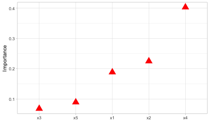


## Linear models

In multiple linear regression, or linear models (LMs), the absolute value of the $t$-statistic (or some other scaled variant of the estimated coefficients) is commonly used as a measure of VI.^[Since this approach is biased towards large-scale features it is important to properly standardize the predictors (before fitting the model) or the estimated coefficients.] The same idea also extends to generalized linear models (GLMs). In the code chunk below, we fit an LM to the simulated Friedman data (`trn`) allowing for all main effects and two-way interactions, then use the `step()` function to perform backward elimination. The resulting VIP is displayed in Figure \@ref(fig:vip-step).


```r
# Fit a LM
linmod <- lm(y ~ .^2, data = trn)
backward <- step(linmod, direction = "backward", trace = 0)

# Extract VI scores
(vi_backward <- vi(backward))
```

```
## # A tibble: 21 × 3
##    Variable Importance Sign 
##    <chr>         <dbl> <chr>
##  1 x4            14.2  POS  
##  2 x2             7.31 POS  
##  3 x1             5.63 POS  
##  4 x5             5.21 POS  
##  5 x3:x5          2.46 POS  
##  6 x1:x10         2.41 NEG  
##  7 x2:x6          2.41 NEG  
##  8 x1:x5          2.37 NEG  
##  9 x10            2.21 POS  
## 10 x3:x4          2.01 NEG  
## # ℹ 11 more rows
```

```r
# Plot VI scores; by default, `vip()` displays the top ten features
pal <- palette.colors(2, palette = "Okabe-Ito")  # colorblind friendly palette
vip(vi_backward, num_features = length(coef(backward)),  # Figure 3
    geom = "point", horizontal = FALSE, mapping = aes(color = Sign)) +
  scale_color_manual(values = unname(pal)) +
  theme_light() +
  theme(axis.text.x = element_text(angle = 45, hjust = 1))
```

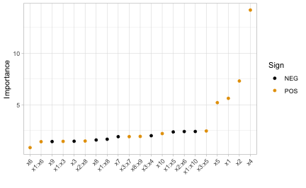

A major limitation of this approach is that a VI score is assigned to each term in the model, rather than to each individual feature! We can solve this problem using one of the model-agnostic approaches discussed later.

Multivariate adaptive regression splines (MARS), which were introduced in @multivariate-friedman-1991, is an automatic regression technique and can be seen as a generalization of LMs and GLMs. In the MARS algorithm, the contribution (or VI score) for each predictor is determined using a generalized cross-validation (GCV) statistic (though, other statistics can also be used; see \code{?vip::vi\_model} for details). An example using the [earth](https://cran.r-project.org/package=earth) package [@R-earth-fixed] is given below (the results are plotted in Figure \@ref(fig:vip-earth)):


```r
# Load required packages
library(earth)

# Fit a MARS model
mars <- earth(y ~ ., data = trn, degree = 2, pmethod = "exhaustive")

# Extract VI scores
vi(mars, type = "gcv")
```

```
## # A tibble: 10 × 2
##    Variable Importance
##    <chr>         <dbl>
##  1 x4            100  
##  2 x1             83.2
##  3 x2             83.2
##  4 x5             59.3
##  5 x3             43.5
##  6 x6              0  
##  7 x7              0  
##  8 x8              0  
##  9 x9              0  
## 10 x10             0
```

```r
# Plot VI scores (Figure 4)
vip(mars)
```

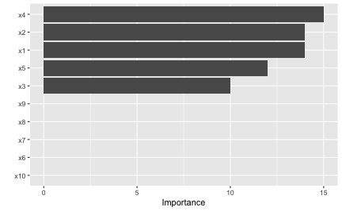

To access VI scores directly in [earth](https://cran.r-project.org/package=earth), you can use the `earth::evimp()` function.


## Neural networks

For neural networks (NNs), two popular methods for constructing VI scores are the Garson algorithm [@interpreting-garson-1991], later modified by @back-goh-1995, and the Olden algorithm [@accurate-olden-2004]. For both algorithms, the basis of these VI scores is the network’s connection weights. The Garson algorithm determines VI by identifying all weighted connections between the nodes of interest. Olden’s algorithm, on the other hand, uses the products of the raw connection weights between each input and output neuron and sums these products across all hidden neurons. This has been shown to outperform the Garson method in various simulations. For DNNs, a similar method due to @data-gedeon-1997 considers the weights connecting the input features to the first two hidden layers (for simplicity and speed); but this method can be slow for large networks. We illustrate these two methods below using `vip()` with the [nnet](https://cran.r-project.org/package=nnet) package [@R-nnet] (see the results in Figure \@ref(fig:vip-nnet)).


```r
# Load required packages
library(nnet)

# Fit a neural network
set.seed(0803)  # for reproducibility
nn <- nnet(y ~ ., data = trn, size = 7, decay = 0.1,
           linout = TRUE, trace = FALSE)

# Construct VIPs
p1 <- vip(nn, type = "garson")
p2 <- vip(nn, type = "olden")

# Display plots in a grid (Figure 5)
p1 + p2
```

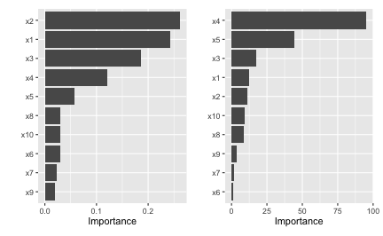


# Model-agnostic VI

Model-agnostic interpretability separates interpretation from the model. Compared to model-specific approaches, model-agnostic VI methods are more flexible and can be applied to any supervised learning algorithm. In this section, we discuss model-agnostic methods for quantifying global feature importance using three different approaches:

1) a simple variance-based approach;
2) permutation-based feature importance;
3) Shapley-based feature importance.


## Variance-based methods

Our first model-agnostic method is based on a simple *feature importance ranking measure* (FIRM); for details, see @greenwell-simple-2018, @zien-2009-feature, and @scholbeck-2019-sampling. The specific approach used here is based on quantifying the "flatness" of the effects of each feature.^[A similar approach is taken in the [vivo](https://cran.r-project.org/package=vivo) package [@R-vivo].] Feature effects can be assessed using *partial dependence plots* (PDPs) \citep{friedman-2001-greedy} or *individual conditional expectation* (ICE) curves [@goldstein-peeking-2015]. PDPs and ICE curves help visualize the effect of low cardinality subsets of the feature space on the estimated prediction surface (e.g., main effects and two/three-way interaction effects.). They are also model-agnostic and can be constructed in the same way for any supervised learning algorithm. Below, we fit a *projection pursuit regression* (PPR) model (see `?stats::ppr` for details and references) and construct PDPs for each feature using the [pdp](https://cran.r-project.org/package=pdp) package @pdp2017. The results are displayed in Figure \@ref(fig:pdp-ppr). Notice how the PDPs for the uninformative features are relatively flat compared to the PDPs for features `x1`--`x5`!

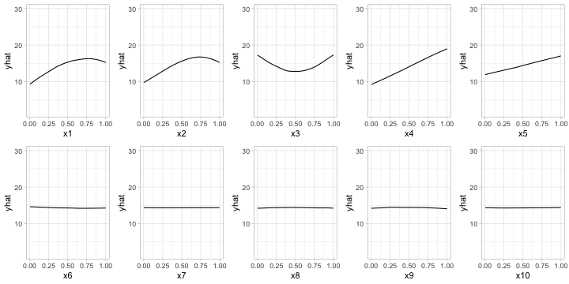

Next, we compute PDP-based VI scores for the fitted PPR and NN models. The PDP method constructs VI scores that quantify the relative "flatness" of each PDP (by default, this is defined by computing the standard deviation of the $y$-axis values for each PDP). To use the PDP method, specify `method = "firm"` in the call to `vi()` or `vip()` (or just use `vi_firm()` directly):


```r
# Fit a PPR model (nterms was chosen using the caret package with 5 repeats of
# 5-fold cross-validation)
pp <- ppr(y ~ ., data = trn, nterms = 11)

# Construct VIPs
p1 <- vip(pp, method = "firm") + ggtitle("PPR")
p2 <- vip(nn, method = "firm") + ggtitle("NN")

# Display plots in a grid (Figure 7)
p1 + p2
```

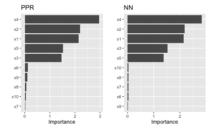

In Figure \@ref(fig:pdp-ppr-nn) we display the PDP-based feature importance for the previously obtained PPR and NN models. These VI scores essentially capture the variability in the partial dependence values for each main effect.

The ICE curve method is similar to the PDP method, except that we measure the "flatness" of each individual ICE curve and then aggregate the results (e.g., by averaging). If there are no (substantial) interaction effects, using ICE curves will produce results similar to using PDPs (which are just averaged ICE curves). However, if strong interaction effects are present, they can obfuscate the main effects and render the PDP-based approach less useful (since the PDPs for important features can be relatively flat when certain interactions are present; see @goldstein-peeking-2015 for details). In fact, it is probably safest to always use ICE curves when employing the FIRM method.

Below, we display the ICE curves for each feature in the fitted PPR model using the same $y$-axis scale; see Figure \@ref(fig:ice-ppr). Again, there is a clear difference between the ICE curves for features `x1`--`x5` and `x6`--`x10`; the later being relatively flat by comparison. Also, notice how the ICE curves within each feature are relatively parallel (if the ICE curves within each feature were perfectly parallel, the standard deviation for each curve would be the same and the results will be identical to the PDP method). In this example, the interaction term between `x1` and `x2` does not obfuscate the PDPs for the main effects and the results are not much different.


Obtaining the ICE-based feature importance scores is also straightforward, just specify `ice = TRUE` when using the FIRM approach. This is illustrated in the code chunk below and the results, which are displayed in Figure \@ref(fig:vip-ice-ppr-nn), are similar to those obtained using the PDP method.


```r
# Construct VIPs
p1 <- vip(pp, method = "firm", ice = TRUE) + ggtitle("PPR")
p2 <- vip(nn, method = "firm", ice = TRUE) + ggtitle("NN")

# Display plots in a grid (Figure 9)
p1 + p2
```

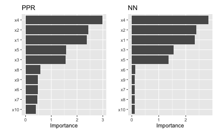

When using `method = "firm"`, the feature effect values are stored in an attribute called `"effects"`. This is a convenience so that the feature effect plots (e.g., PDPs and ICE curves) can easily be reconstructed and compared with the VI scores, as demonstrated in the example below (see Figure \@ref(fig:pdp-from-attr)):


```r
# Construct PDP-based VI scores
(vis <- vi(pp, method = "firm"))
```

```
## # A tibble: 10 × 2
##    Variable Importance
##    <chr>         <dbl>
##  1 x4           2.96  
##  2 x2           2.21  
##  3 x1           2.14  
##  4 x5           1.53  
##  5 x3           1.46  
##  6 x6           0.128 
##  7 x9           0.114 
##  8 x8           0.0621
##  9 x10          0.0374
## 10 x7           0.0170
```

```r
# Reconstruct PDPs for all 10 features (Figure 10)
par(mfrow = c(2, 5))
for (name in paste0("x", 1:10)) {
  plot(attr(vis, which = "effects")[[name]], type = "l", ylim = c(9, 19), las = 1)
}
```

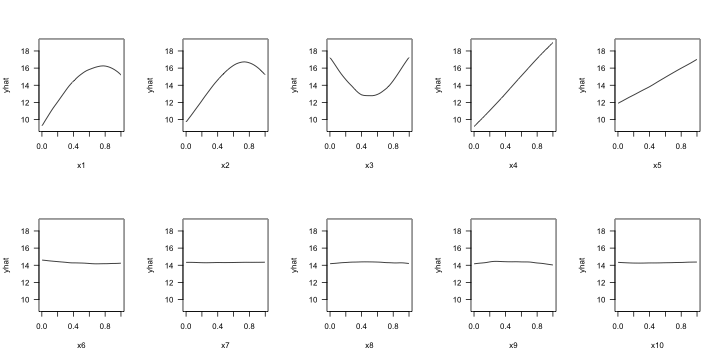


## Permutation method

The permutation method exists in various forms and was made popular in @random-breiman-2001 for RFs, before being generalized and extended in @fisher-model-2018. The permutation approach used in [vip](https://cran.r-project.org/package=vip) is quite simple and is outlined in Algorithm 1 below. The idea is that if we randomly permute the values of an important feature in the training data, the training performance would degrade (since permuting the values of a feature effectively destroys any relationship between that feature and the target variable). This of course assumes that the model has been properly tuned (e.g., using cross-validation) and is not over fitting. The permutation approach uses the difference between some baseline performance measure (e.g., training $R^2$, AUC, or RMSE) and the same performance measure obtained after permuting the values of a particular feature in the training data (**Note:** the model is NOT refit to the training data after randomly permuting the values of a feature). It is also important to note that this method may not be appropriate when you have, for example, highly correlated features (since permuting one feature at a time may lead to unlikely data instances).

Let $x_1, x_2, \dots, x_j$ be the features of interest and let $M_{orig}$ be the baseline performance metric for the trained model; for brevity, we'll assume smaller is better (e.g., classification error or RMSE). The permutation-based importance scores can be computed as follows:


1. For $i = 1, 2, \dots, j$:
  a. Permute the values of feature $x_i$ in the training data.
  b. Recompute the performance metric on the permuted data $M_{perm}$.
  c. Record the difference from baseline using $VI\left(x_i\right) = M_{perm} - M_{orig}$.
2. Return the VI scores $VI\left(x_1\right), VI\left(x_2\right), \dots, VI\left(x_j\right)$.

Algorithm 1: A simple algorithm for constructing permutation-based VI scores.


Algorithm 1 can be improved or modified in a number of ways. For instance, the process can be repeated several times and the results averaged together. This helps to provide more stable VI scores, and also the opportunity to measure their variability. Rather than taking the difference in step (c), @molnar-2019-iml [sec. 5.5.4] argues that using the ratio $M_{perm} / M_{orig}$ makes the importance scores more comparable across different problems. It's also possible to assign importance scores to groups of features (e.g., by permuting more than one feature at a time); this would be useful if features can be categorized into mutually exclusive groups, for instance, categorical features that have been *one-hot-encoded.

To use the permutation approach in [vip](https://cran.r-project.org/package=vip), specify `method = "permute"` in the call to `vi()` or `vip()` (or you can use `vi_permute()` directly). Note that using `method = "permute"` requires specifying a few additional arguments (e.g., the training data, target name or vector of target values, a prediction function, etc.); see `?vi_permute` for details.

To use `vi_permute()` you should first define a prediction wrapper that tells the function how to generate the write predictions for your chosen metric. An example is given below for the previously fitted PPR and NN models. Here we use $R^2$ (`metric = "rsq"`) as the evaluation metric. The results, which are displayed in Figure \@ref(fig:vip-permute-ppr-nn), agree with those obtained using the PDP- and ICE-based methods.


```r
# Prediction wrapper
pfun_ppr <- function(object, newdata) {  # needs to return a numeric vector
  stats::predict(object, newdata = newdata)
}
pfun_nnet <- function(object, newdata) {  # needs to return a numeric vector
  stats::predict(object, newdata = newdata)[, 1L, drop = TRUE]
}

# Plot VI scores
set.seed(2021)  # for reproducibility
p1 <- vip(pp, method = "permute", target = "y", metric = "rsq",
          pred_wrapper = pfun_ppr) + ggtitle("PPR")
p2 <- vip(nn, method = "permute", target = "y", metric = "rsq",
          pred_wrapper = pfun_nnet) + ggtitle("NN")

# Display plots in a grid (Figure 11)
p1 + p2
```

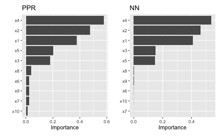

The permutation approach introduces randomness into the procedure and therefore should be run more than once if computationally feasible. The upside to performing multiple runs of Algorithm 1 is that it allows us to compute standard errors (among other metrics) for the estimated VI scores, as illustrated in the example below; here we specify `nsim = 30` to request that each feature be permuted 30 times and the results averaged together. (Additionally, if `nsim > 1`, you can set \code{geom = "boxplot"} in the call to `vip()` to construct boxplots of the raw permutation-based VI scores. This is useful if you want to visualize the variability in each of the VI estimates; see Figure \@ref(fig:vip-boxplots) for an example.)


```r
# Use 10 Monte Carlo reps
set.seed(403)  # for reproducibility
vis <- vi(pp, method = "permute", target = "y", metric = "rsq",
          pred_wrapper = pfun_ppr, nsim = 30)
vip(vis, geom = "boxplot")  # Figure 12
```

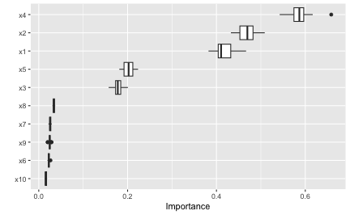

All available performance metrics for regression and classification can be listed using the `list_metrics()` function, for example:


```r
list_metrics()
```

```
##          metric                               description
## 1      accuracy                   Classification accuracy
## 2  bal_accuracy          Balanced classification accuracy
## 3        youden Youden;'s index (or Youden's J statistic)
## 4       roc_auc                      Area under ROC curve
## 5        pr_auc    Area under precision-recall (PR) curve
## 6       logloss                                  Log loss
## 7         brier                               Brier score
## 8           mae                       Mean absolute error
## 9          mape            Mean absolute percentage error
## 10         rmse                   Root mean squared error
## 11          rsq                   R-squared (correlation)
## 12     rsq_trad                   R-squared (traditional)
##                                task smaller_is_better yardstick_function
## 1  Binary/multiclass classification             FALSE       accuracy_vec
## 2  Binary/multiclass classification             FALSE   bal_accuracy_vec
## 3  Binary/multiclass classification             FALSE            j_index
## 4             Binary classification             FALSE        roc_auc_vec
## 5             Binary classification             FALSE         pr_auc_vec
## 6  Binary/multiclass classification              TRUE    mn_log_loss_vec
## 7  Binary/multiclass classification              TRUE    brier_class_vec
## 8                        Regression              TRUE            mae_vec
## 9                        Regression              TRUE           mape_vec
## 10                       Regression              TRUE           rmse_vec
## 11                       Regression             FALSE            rsq_vec
## 12                       Regression             FALSE       rsq_trad_vec
```

The permutation method in [vip](https://cran.r-project.org/package=vip) supports the vector performance functions available in [yardstick](https://cran.r-project.org/package=yardstick) [@R-yardstick]. We can also use a custom metric (i.e., loss function). Suppose for example you want to measure importance using the *mean absolute error* (MAE):

\begin{equation}
  MAE = \frac{1}{n}\sum_{i = 1}^n\left|y_i - \hat{f}\left(\boldsymbol{x}_i\right)\right|,
\end{equation}

where $\hat{f}\left(\boldsymbol{x}_i\right)$ is the predicted value of $y_i$. A simple function implementing this metric is given below (to be consistent with [yardstick](https://cran.r-project.org/package=yardstick) functions, user-supplied metric functions require two arguments: `truth` and `estimate`).


```r
mae <- function(truth, estimate) {
  mean(abs(truth - estimate))
}
```

To use this for computing permutation-based VI scores just pass it via the `metric` argument (be warned, however, that the metric used for computing permutation importance should be the same as the metric used to train and tune the model). Also, since this is a custom metric, we need to specify whether a smaller value indicates better performance by setting `smaller_is_better = TRUE`. The results, which are displayed in Figure \@ref(fig:vip-nn-mae), are similar to those in Figure \@ref(fig:vip-permute-ppr-nn), albeit a different scale.


```r
# Construct VIP (Figure 13)
set.seed(2321)  # for reproducibility
p1 <- vip(nn, method = "permute", target = "y", metric = mae,
    smaller_is_better = TRUE, pred_wrapper = pfun_nnet) +
  ggtitle("Custom loss function: MAE")
set.seed(2321)  # for reproducibility
p2 <- vip(nn, method = "permute", target = "y", metric = yardstick::mae_vec,
    smaller_is_better = TRUE, pred_wrapper = pfun_nnet) +
  ggtitle("Using `yardstick`'s MAE function")
p1 + p2
```

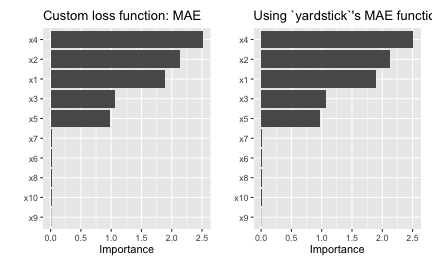

Although permutation importance is most naturally computed on the training data, it may also be useful to do the shuffling and measure performance on new data! This is discussed in depth in @molnar-2019-iml [sec. 5.2]. For users interested in computing permutation importance using new data, just supply it to the `train` argument in the call to `vi()`, `vip()`, or `vi_permute()`. For instance, suppose we wanted to only use a fraction of the original training data to carry out the computations. In this case, we could simply pass the sampled data to the `train` argument as follows:


```r
# Construct VIP (Figure 14)
set.seed(2327)  # for reproducibility
vip(nn, method = "permute", pred_wrapper = pfun_nnet, target = "y",
    metric = "rmse",
    train = trn[sample(nrow(trn), size = 400), ]) +  # sample 400 observations
  ggtitle("Using a random subset of training data")
```

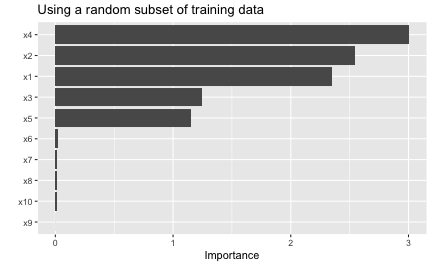

When using the permutation method with `nsim > 1`, the default is to keep all the permutation scores as an attribute called `"raw_scores"`; you can turn this behavior off by setting `keep = FALSE` in the call to `vi_permute()`, `vi()`, or `vip()`. If `keep = TRUE` and `nsim > 1`, you can request all permutation scores to be plotted by setting `all_permutations = TRUE` in the call to `vip()`, as demonstrated in the code chunk below (see Figure \@ref(fig:vip-nn-mae-all)). This also let's you visually inspect the variability in the permutation scores within each feature.


```r
# Construct VIP (Figure 15)
set.seed(8264)  # for reproducibility
vip(nn, method = "permute", pred_wrapper = pfun_nnet, target = "y",
    metric = "mae", nsim = 10, geom = "point",
    all_permutations = TRUE, jitter = TRUE) +
  ggtitle("Plotting all permutation scores")
```

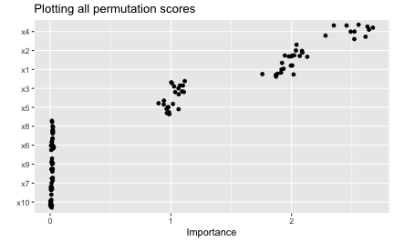


### A classification example

In this example, we'll illustrate the use of permutation importance in a classification problem. To start, we'll use the [randomForest](https://cran.r-project.org/package=randomForest) package [@R-randomForest] to build a (default) random forest to predict survivability of passengers on the ill-fated Titanic.

The [source data](https://hbiostat.org/data/) (also available in `vip::titanic`) contains 263 missing values (i.e., `NA`'s) in the age column. The `titanic_mice` version, which we'll use in this vignette, contains imputed values for the age column using *multivariate imputation by chained equations* via the [mice](https://cran.r-project.org/package=mice) package. Consequently, `titanic_mice` is a list containing 11 imputed versions of the original data; see `?vip::titanic_mice` for details. For now, we'll just use one of the 11 imputed versions:


```r
head(t1 <- vip::titanic_mice[[1L]])
```

```
##   survived pclass   age    sex sibsp parch
## 1      yes      1 29.00 female     0     0
## 2      yes      1  0.92   male     1     2
## 3       no      1  2.00 female     1     2
## 4       no      1 30.00   male     1     2
## 5       no      1 25.00 female     1     2
## 6      yes      1 48.00   male     0     0
```

```r
t1$pclass <- as.ordered(t1$pclass)  # makes more sense as an ordered factor
```

Next, we'll build a default random forest to predict survivability:


```r
library(randomForest)

set.seed(2053)  # for reproducibility
(rfo <- randomForest(survived ~ ., data = t1, importance = TRUE, nPerm = 30))
```

```
## 
## Call:
##  randomForest(formula = survived ~ ., data = t1, importance = TRUE,      nPerm = 30) 
##                Type of random forest: classification
##                      Number of trees: 500
## No. of variables tried at each split: 2
## 
##         OOB estimate of  error rate: 18.79%
## Confusion matrix:
##      no yes class.error
## no  727  82   0.1013597
## yes 164 336   0.3280000
```

For comparison, here's a plot of the OOB-based permutation importance scores available in a random forest (note that setting `include_type = TRUE` results in the $x$-axis label including the method of importance that was computed):


```r
vip(rfo, include_type = TRUE)
```

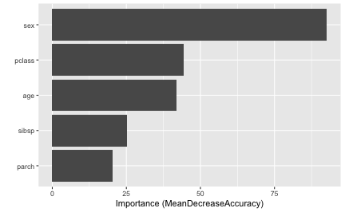

For categorical outcomes, random forests can provide predicted class labels (i.e., classification) or predicted class probabilities (i.e., prediction), as shown below.


```r
head(predict(rfo, newdata = t1, type = "response"))  # predicted class labels
```

```
##   1   2   3   4   5   6 
## yes yes yes  no yes  no 
## Levels: no yes
```

```r
head(predict(rfo, newdata = t1, type = "prob"))  # predicted class probabilities
```

```
##      no   yes
## 1 0.014 0.986
## 2 0.114 0.886
## 3 0.472 0.528
## 4 0.716 0.284
## 5 0.392 0.608
## 6 0.894 0.106
```

The performance metric we choose for permutation importance will determine whether our prediction wrapper should return a class label (as a factor) or a numeric vector of class probabilities. We'll start with classification accuracy (the same metric used by random forest's build-in OOB-based permutation VI scores). A basic call to `vi()` (or, similarly, to `vi_permute()`) would look something like:


```r
pfun_class <- function(object, newdata) {  # prediction wrapper
  predict(object, newdata = newdata, type = "response")
}

# Compute mean decrease in accuracy
set.seed(1359)  # for reproducibility
vi(rfo,
   method = "permute",
   train = t1,
   target = "survived",
   metric = "accuracy",  # or pass in `yardstick::accuracy_vec` directly
   # smaller_is_better = FALSE,  # no need to set for built-in metrics
   pred_wrapper = pfun_class,
   nsim = 30  # use 30 repetitions
)
```

```
## # A tibble: 5 × 3
##   Variable Importance   StDev
##   <chr>         <dbl>   <dbl>
## 1 sex          0.226  0.0111 
## 2 pclass       0.0801 0.00488
## 3 age          0.0738 0.00595
## 4 sibsp        0.0346 0.00459
## 5 parch        0.0166 0.00247
```
Note that the standard deviation of each VI score is also computed and returned whenever `nsim > 1`. The results are comparable to what the fitted random forest computed internally by setting `importance = TRUE` and `nPerm = 30`; the difference as that the random forest uses the OOB data when computing the drop in accuracy after shuffling each variable.


```r
sort(rfo$importance[, "MeanDecreaseAccuracy"], decreasing = TRUE)
```

```
##        sex     pclass        age      parch      sibsp 
## 0.17102147 0.05877827 0.04408406 0.01895065 0.01583429
```

Next, we'll compute permutation VI scores using a metric that requires predicted probabilities. Here, we'll use the Brier score, which measures the accuracy of the individual probabilities (smaller is better). However, instead of using the built-in `metric = "brier"` option, we'll pass the corresponding [yardstick](https://cran.r-project.org/package=yardstick) function directly. Note that we have to modify the prediction wrapper to not only return predicted probabilities, but a single vector of probabilities in the case of a binary outcome (in this case, we care about the event `survived = "yes"`):


```r
pfun_prob <- function(object, newdata) {  # prediction wrapper
  predict(object, newdata = newdata, type = "prob")[, "yes"]
}

# Compute mean increase in Brier score
set.seed(1411)  # for reproducibility
vi(rfo,
   method = "permute",
   train = t1,
   target = "survived",
   metric = yardstick::brier_class_vec,  # or pass in `"brier"` directly
   smaller_is_better = FALSE,  # need to set when supplying a function
   pred_wrapper = pfun_prob,
   nsim = 30  # use 30 repetitions
)
```

```
## # A tibble: 5 × 3
##   Variable Importance   StDev
##   <chr>         <dbl>   <dbl>
## 1 sex          0.209  0.00866
## 2 pclass       0.0977 0.00479
## 3 age          0.0947 0.00460
## 4 parch        0.0542 0.00271
## 5 sibsp        0.0414 0.00186
```
Finally, to illustrate the use of the `event_level` argument, we'll compute the permutation-based VI scores using the *area under the ROC curve* (AUROC or `metric = "roc_auc"`).


```r
set.seed(1413)  # for reproducibility
vi(rfo,
   method = "permute",
   train = t1,
   target = "survived",
   metric = "roc_auc",
   pred_wrapper = pfun_prob,
   nsim = 30  # use 30 repetitions
)
```

```
## # A tibble: 5 × 3
##   Variable Importance   StDev
##   <chr>         <dbl>   <dbl>
## 1 parch       -0.0251 0.00351
## 2 sibsp       -0.0283 0.00211
## 3 age         -0.0850 0.00477
## 4 pclass      -0.0920 0.00533
## 5 sex         -0.229  0.0137
```
Why are the results are negative? The issue is that metrics like AUROC (similar with *area under the PR curve*) treat one of the class outcomes as the "event" of interest. In our case, we are using the predicted probability for the event `survived = "yes"`, but the default event level (in [yardstick](https://cran.r-project.org/package=yardstick) and therefore [vip](https://cran.r-project.org/package=vip)) is always the first class label in alphabetical order (or `survived = "no"`, in this case):


```r
levels(titanic$survived)
```

```
## [1] "no"  "yes"
```

Consequently, when using metrics like AUROC, it is a good idea to set the `event_level` parameter in the call to `vi()` or `vi_permute()`. To fix the previous issue, just set the event level to the second class label using `even_level = "second"`:


```r
set.seed(1413)  # for reproducibility
vi(rfo,
   method = "permute",
   train = t1,
   target = "survived",
   metric = "roc_auc",
   event_level = "second",  # use "yes" as class label/"event" of interest
   pred_wrapper = pfun_prob,
   nsim = 30  # use 30 repetitions
)
```

```
## # A tibble: 5 × 3
##   Variable Importance   StDev
##   <chr>         <dbl>   <dbl>
## 1 sex          0.229  0.0137 
## 2 pclass       0.0920 0.00533
## 3 age          0.0850 0.00477
## 4 sibsp        0.0283 0.00211
## 5 parch        0.0251 0.00351
```
Much better (and just the negative of the previous results, as expected)! For a similar example using a multiclass outcome, see the discussion in [this issue](https://github.com/juliasilge/juliasilge.com/issues/57).


### Benchmarks

In this section, we compare the performance of four implementations of permutation-based VI scores: `iml::FeatureImp()` (version 0.11.1), `ingredients::feature_importance()` (version 2.3.0),  `mmpf::permutationImportance` (version 0.0.5), and `vip::vi()` (version 0.3.2.9000).

We simulated 10,000 training observations from the Friedman 1 benchmark problem and trained a random forest using the [ranger](https://cran.r-project.org/package=ranger) package. For each implementation, we computed permutation-based VI scores 100 times using the [microbenchmark](https://cran.r-project.org/package=microbenchmark) package [@R-microbenchmark]. For this benchmark we did not use any of the parallel processing capability available in the [iml](https://cran.r-project.org/package=iml) and [vip](https://cran.r-project.org/package=vip) implementations. The results from [microbenchmark](https://cran.r-project.org/package=microbenchmark) are displayed in Figure \ref@(fig:benchmark) and summarized in the output below. In this case, the [vip](https://cran.r-project.org/package=vip) package (version 0.3.2.9000) was the fastest, followed closely by [ingredients](https://cran.r-project.org/package=ingredients) and [mmpf](https://cran.r-project.org/package=mmpf). It should be noted, however, that the implementations in [vip](https://cran.r-project.org/package=vip) and [iml](https://cran.r-project.org/package=iml) can be parallelized. To the best of our knowledge, this is not the case for [ingredients](https://cran.r-project.org/package=ingredients) or [mmpf](https://cran.r-project.org/package=mmpf) (although it would not be difficult to write a simple parallel wrapper for either). The code used to generate these benchmarks can be found at http://bit.ly/2TogXrq.

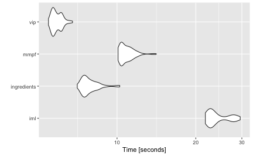


## Shapley method

Although [vip](https://cran.r-project.org/package=vip) focuses on global VI methods, it is becoming increasing popular to asses global importance by aggregating local VI measures; in particular, *Shapley explanations* [@strumbelj-2014-explaining]. Using *Shapley values* (a method from coalitional game theory), the prediction for a single instance $x^\star$ can be explained by assuming that each feature value in $x^\star$ is a "player" in a game with a payout equal to the corresponding prediction $\hat{f}\left(x^\star\right)$. Shapley values tell us how to fairly distribute the "payout" (i.e., prediction) among the features. Shapley values have become popular due to the attractive fairness properties they posses [@lundberg_unified_2017]. The most popular implementation is available in the Python [shap](https://github.com/slundberg/shap) package [@lundberg_unified_2017]; although a number of implementations are now available in R; for example, [iml](https://cran.r-project.org/package=iml), [iBreakDown](https://cran.r-project.org/package=iBreakDown) [@R-iBreakDown], and [fastshap](https://cran.r-project.org/package=fastshap) [@R-fastshap].

Obtaining a global VI score from Shapley values requires aggregating the Shapley values for each feature across the entire training set (or at least a reasonable sample thereof). In particular, we use the mean of the absolute value of the individual Shapley values for each feature. Unfortunately, Shapley values can be computationally expensive, and therefore this approach may not be feasible for large training sets (say, >3000 observations). The [fastshap](https://cran.r-project.org/package=fastshap) package provides some relief by exploiting a few computational tricks, including the option to perform computations in parallel (see \code{?fastshap::explain} for details). Also, fast and exact algorithms \citep{lundberg-explainable-2019} can be exploited for certain classes of models.

Starting with [vip](https://cran.r-project.org/package=vip) version 0.3.2.9000 you can now use `method = "shap"` in the call to `vi()` (or use `vi_shap()` directly) to compute global Shapley-based VI scores using the method described above (provided you have the [fastshap](https://cran.r-project.org/package=fastshap) package installed)---see `?vip::vi_shap` for details. To illustrate, we compute Shapley-based VI scores from an [xgboost](https://cran.r-project.org/package=xgboost) model [R-xgboost] using the Friedman data from earlier; the results are displayed in Figure \ref@(fig:vi-shap).^[Note that the `exact = TRUE` option is only available if you have [fastshap](https://cran.r-project.org/package=fastshap) version 0.0.4 or later.] (**{Note:** specifying `include_type = TRUE` in the call to `vip()` causes the type of VI computed to be displayed as part of the axis label.)


```r
# Load required packages
library(xgboost)

# Feature matrix
X <- data.matrix(subset(trn, select = -y))  # matrix of feature values

# Fit an XGBoost model; hyperparameters were tuned using 5-fold CV
set.seed(859)  # for reproducibility
bst <- xgboost(X, label = trn$y, nrounds = 338, max_depth = 3, eta = 0.1,
               verbose = 0)

# Construct VIP (Figure 17)
vip(bst, method = "shap", train = X, exact = TRUE, include_type = TRUE,
    geom = "point", horizontal = FALSE,
    aesthetics = list(color = "forestgreen", shape = 17, size = 5)) +
  theme_light()
```

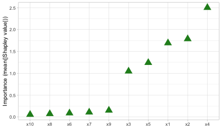

Passing `exact = TRUE` to `fastshap::explain()` via the `...` argument in the call to `vip()` (or `vi()` and `vi_shap()`) only works for [lightgbm](https://cran.r-project.org/package=lightgbm), [xgboost](https://cran.r-project.org/package=xgboost), and additive (generalized) linear models fit using R's internal **`stats`** package. For all other cases, a prediction wrapper must be supplied via the `...` argument.

To illustrate, let's use the previous random forest that was fit to the Titanic data set. Note that Shapley explanation do not support classification, so we'll have to use the probability-based prediction wrapper defined before:


```r
pfun_prob <- function(object, newdata) {  # prediction wrapper
  # For Shapley explanations, this should ALWAYS return a numeric vector
  predict(object, newdata = newdata, type = "prob")[, "yes"]
}

# Compute Shapley-based VI scores
set.seed(853)  # for reproducibility
vi_shap(rfo, train = subset(t1, select = -survived), pred_wrapper = pfun_prob,
        nsim = 30)
```

```
## # A tibble: 5 × 2
##   Variable Importance
##   <chr>         <dbl>
## 1 pclass       0.104 
## 2 age          0.0649
## 3 sex          0.272 
## 4 sibsp        0.0260
## 5 parch        0.0291
```


## Drawbacks of existing methods

As discussed in @hooker-2019-stop, *permute-and-predict* methods&mdash;like PDPs, ICE curves, and permutation importance&mdash;can produce results that are highly misleading.^[It's been argued that approximate Shapley values share the same drawback, however, @janzing-2019-feature makes a compelling case against those arguments.] For example, the standard approach to computing permutation-based VI scores involves independently permuting individual features. This implicitly makes the assumption that the observed features are statistically independent. In practice, however, features are often not independent which can lead to nonsensical VI scores. One way to mitigate this issue is to use the conditional approach described in @strobl-2019-conditional; @hooker-2019-stop provides additional alternatives, such as *permute-and-relearn importance*. Unfortunately, to the best of our knowledge, this approach is not yet available for general purpose. A similar modification can be applied to PDPs [@parr-2019-technical]^[A basic R implementation is available at <https://github.com/bgreenwell/rstratx>.] which seems reasonable to use in the FIRM approach when strong dependencies among the features are present (though, we have not given this much thought or consideration).

We already mentioned that PDPs can be misleading in the presence of strong interaction effects. This drawback, of course, equally applies to the FIRM approach using PDPs for computing VI scores. As discussed earlier, this can be mitigated by using ICE curves instead. Another alternative would be to use *accumulated local effect* (ALE) plots [@apley-2016-visualizing] (though we haven't really tested this idea). Compared to PDPs, ALE plots have the advantage of being faster to compute and less affected by strong dependencies among the features. The downside, however, is that ALE plots are more complicated to implement (hence, they are not currently available when using `method = "firm"`). ALE plots are available in the [ALEPlot](https://cran.r-project.org/package=ALEPlot) [@R-ALEPlot] and [iml](https://cran.r-project.org/package=iml) packages.

@hooker-2007-generalized also argues that feature importance (which concern only *main effects*) can be misleading in high dimensional settings, especially when there are strong dependencies and interaction effects among the features, and suggests an approach based on a *generalized functional ANOVA decomposition*&mdash;though, to our knowledge, this approach is not widely implemented in open source.


## Summary

VIPs help to visualize the strength of the relationship between each feature and the predicted response, while accounting for all the other features in the model. We've discussed two types of VI: model-specific and model-agnostic, as well as some of their strengths and weaknesses. In this paper, we showed how to construct VIPs for various types of "black box" models in R using the [vip](https://cran.r-project.org/package=vip) package. We also briefly discussed related approaches available in a number of other R packages. Suggestions to avoid high execution times were discussed and demonstrated via examples. This paper is based on [vip](https://cran.r-project.org/package=vip) version 0.3.2.9000. In terms of future development, [vip](https://cran.r-project.org/package=vip) can be expanded in a number of ways. For example, we plan to incorporate the option to compute group-based and conditional permutation scores. Although not discussed in this paper, [vip](https://cran.r-project.org/package=vip) also includes a promising statistic (similar to the variance-based VI scores previously discussed) for measuring the relative strength of interaction between features. Although VIPs can help understand which features are driving the model's predictions, ML practitioners should be cognizant of the fact that none of the methods discussed in this paper are uniformly best across all situations; they require an accurate model that has been properly tuned, and should be checked for consistency with human domain knowledge.


## Acknowledgments

The authors would like to thank the anonymous reviewers and the Editor for their helpful comments and suggestions. We would also like to thank the members of the 84.51$^{\circ}$ Interpretable Machine Learning Special Interest Group for their thoughtful discussions on the topics discussed herein.


## References
